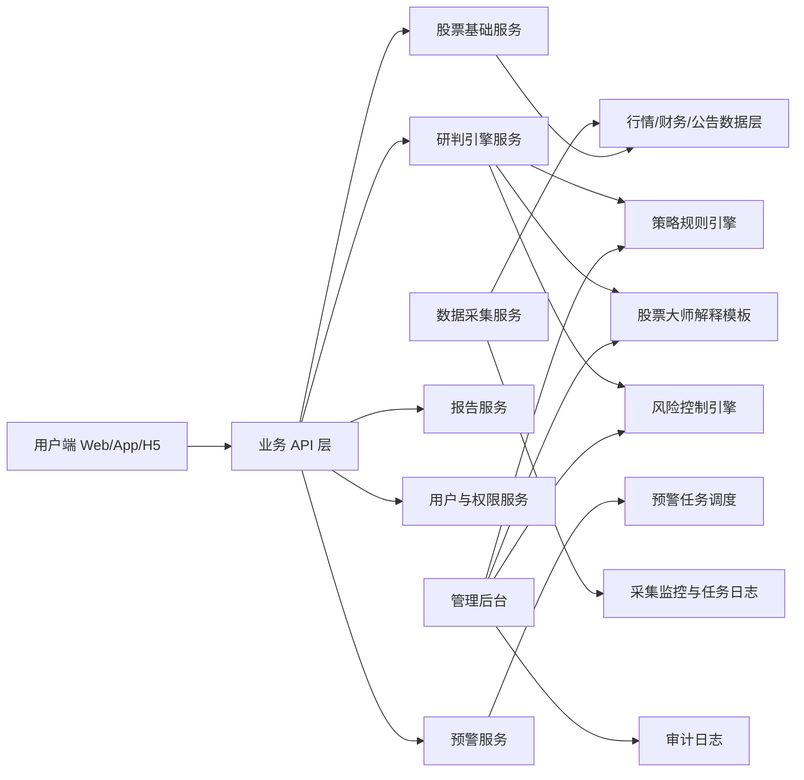
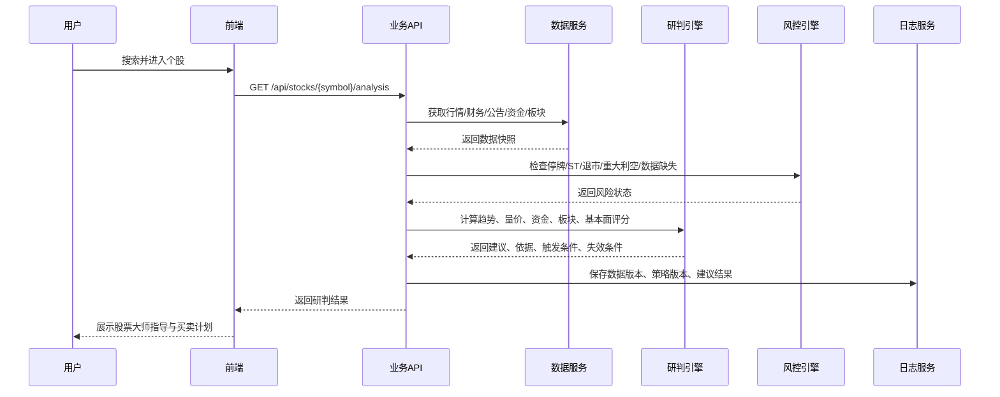
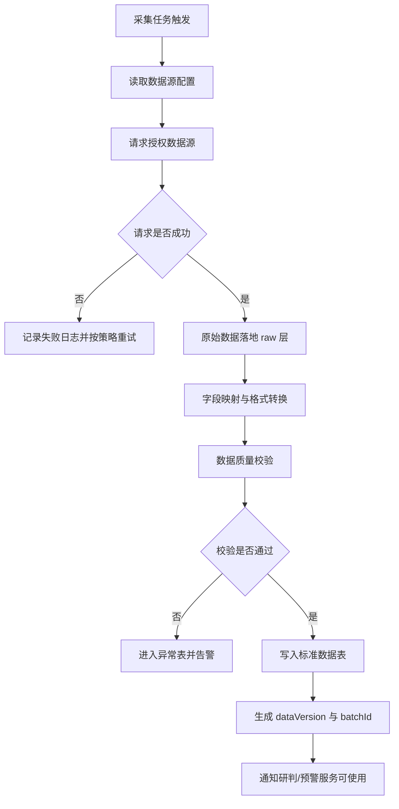

# 股票智能研判与买卖决策辅助系统实施方案

## 1. 文档信息

| 项目 | 内容 |
|---|---|
| 文档名称 | 股票智能研判与买卖决策辅助系统实施方案 |
| 文档版本 | v1.0 |
| 创建日期 | 2026-06-11 |
| 适用范围 | A 股股票智能研判、股票大师指导、买卖计划辅助、预警、后台策略配置 |
| 目标读者 | 产品、研发、测试、数据、运营、合规、商务采购 |
| 当前结论 | 可进入 MVP 研发拆解；数据源供应商和预算为主要外部依赖 |

## 2. 项目定位

本系统定位为 **A 股股票研判与投资学习辅助工具**，核心目标是帮助用户理解某只股票在什么条件下可能上涨、什么条件下可能回调，并基于股票大师知识体系输出条件化的买入、卖出、减仓、观望、止损、止盈计划。

系统不做自动下单，不接证券账户，不托管资金，不承诺收益，不输出无条件交易指令。

## 3. 已确认决策

| 决策项 | 结论 |
|---|---|
| 市场范围 | 首期只做 A 股，覆盖沪市、深市、北交所主要股票 |
| 自动交易 | 不做自动下注、自动下单、跟单、账户接入 |
| 产品形态 | 股票大师指导 + 多因子研判 + 条件化买卖计划 + 预警 + 报告 |
| 建议表达 | 允许出现买入、卖出、减仓、观望，但必须带触发条件、失效条件、风险等级 |
| 数据策略 | 使用授权行情和财务数据源；MVP 可先做延迟行情，但必须展示数据时间 |
| 个性化建议 | MVP 不做强个性化投顾；P1 后再评估风险测评、持仓、偏好 |
| 商业化 | 可采用免费基础研判 + 付费完整大师指导、预警、报告 |

## 4. MVP 目标

### 4.1 用户目标

1. 用户可以搜索 A 股股票并查看基础行情。
2. 用户可以查看该股票当前趋势、上涨条件、回调风险。
3. 用户可以获得股票大师风格的专业解释，而不是单句结论。
4. 用户可以看到买入、卖出、减仓、观望的条件化计划。
5. 用户可以设置关键价位、涨跌幅、风险变化、建议变化预警。

### 4.2 业务目标

1. 搭建可复用的股票研判规则引擎。
2. 搭建可配置的股票大师知识模块。
3. 搭建可追溯的数据、策略、建议日志体系。
4. 支持后续会员权益、报告导出、个性化持仓分析扩展。

## 5. MVP 范围

### 5.1 本期必须做

| 编号 | 模块 | 说明 |
|---|---|---|
| M001 | 股票搜索 | 支持股票代码、名称、拼音搜索 |
| M002 | 个股详情 | 展示基础行情、K 线概要、数据时间 |
| M003 | 股票大师指导 | 按趋势、量价、资金、板块、基本面、风险、交易纪律解释 |
| M004 | 智能研判 | 输出上涨条件、回调条件、综合评分、风险等级 |
| M005 | 买卖计划辅助 | 输出关注、轻仓试探、持有、减仓、卖出、回避等建议 |
| M006 | 预警中心 | 支持价格、涨跌幅、成交量、关键位、建议变化预警 |
| M007 | 数据采集模块 | 采集授权行情、K 线、财务、公告、板块、风险事件等数据 |
| M008 | 后台策略配置 | 配置指标权重、风险阈值、敏感词、文案模板 |
| M009 | 风控合规 | 免责声明、敏感词拦截、高风险拦截、日志留痕 |

### 5.2 本期不做

| 项目 | 原因 |
|---|---|
| 自动下单 | 用户已明确不需要，且合规和交易安全成本高 |
| 证券账户接入 | 涉及券商接口、账户安全、适当性和监管要求 |
| 个性化投顾 | MVP 先做通用研判，个性化需风险测评和更强合规流程 |
| 老师喊单/社群跟单 | 合规和运营争议风险高 |
| 保收益、命中率承诺 | 不符合产品定位和合规边界 |

## 6. 总体架构



## 7. 核心业务流程



## 8. 功能模块实施说明

### 8.1 股票搜索与股票池

| 需求 | 规则 |
|---|---|
| 搜索方式 | 支持代码、名称、拼音首字母 |
| 市场范围 | A 股，含沪市、深市、北交所 |
| 搜索结果 | 股票代码、名称、市场、最新价、涨跌幅、交易状态 |
| 异常处理 | 退市、停牌、数据缺失股票仍可展示，但必须带风险或状态标签 |

### 8.2 个股详情

| 区块 | 展示内容 |
|---|---|
| 基础行情 | 最新价、涨跌幅、成交额、成交量、换手率、量比、数据时间 |
| 趋势摘要 | 短期、中期、长期趋势；强势、震荡、弱势状态 |
| 股票大师结论 | 当前状态、核心机会、核心风险、建议动作 |
| 条件清单 | 上涨条件、回调条件、失效条件 |
| 买卖计划 | 关注位、试探位、确认位、止损位、止盈位、仓位建议 |
| 风险提示 | 数据延迟、投资风险、非收益承诺说明 |

### 8.3 股票大师指导

| 知识模块 | 输入数据 | 输出说明 |
|---|---|---|
| 趋势大师 | K 线、均线、趋势线、箱体高低点 | 当前趋势强弱、突破或跌破判断 |
| 量价大师 | 成交量、成交额、量比、涨跌幅 | 放量突破、缩量反弹、放量滞涨、量价背离 |
| 资金大师 | 主力资金、北向资金、融资融券 | 资金推动、资金撤退、资金分歧 |
| 板块大师 | 行业指数、概念指数、板块龙头 | 是否处于主线板块、是否有补涨逻辑 |
| 基本面大师 | 财报、估值、ROE、业绩预告 | 中期支撑、估值压力、业绩风险 |
| 风险大师 | ST、停牌、退市风险、减持、处罚 | 是否回避、降低仓位、停止建议 |
| 交易纪律大师 | 关键价位、止损位、目标位、仓位 | 操作计划、失效条件、复盘提醒 |

### 8.4 研判引擎

研判引擎由评分层、规则层、解释层组成。

| 层级 | 作用 | 输出 |
|---|---|---|
| 评分层 | 对趋势、量价、资金、板块、基本面、风险打分 | 0-100 分 |
| 规则层 | 根据分数、风险、状态触发建议枚举 | BUY_WATCH / HOLD / REDUCE 等 |
| 解释层 | 使用股票大师模板生成可读解释 | 上涨条件、回调条件、操作计划 |

默认评分建议：

| 因子 | 默认权重 | 说明 |
|---|---:|---|
| 趋势 | 25 | 均线、突破、趋势结构 |
| 量价 | 20 | 放量、缩量、背离、滞涨 |
| 资金 | 20 | 主力资金、北向、融资融券 |
| 板块 | 15 | 行业强度、概念热度、龙头表现 |
| 基本面 | 10 | 财务、估值、业绩事件 |
| 情绪事件 | 10 | 公告、新闻、市场情绪 |
| 风险扣分 | -0 至 -100 | ST、停牌、退市风险、重大利空可直接拦截 |

### 8.5 建议生成规则

| 建议 | 触发条件 | 必须展示 |
|---|---|---|
| 关注 | 分数 55-65，趋势或资金有改善但未确认 | 缺少的确认信号 |
| 轻仓试探 | 分数 65-75，趋势转强且风险不高 | 止损位、失效条件 |
| 回踩关注 | 突破后回踩支撑不破 | 支撑位、跌破后的处理 |
| 持有 | 已满足持有条件，趋势未破 | 持有条件、上移止损 |
| 减仓 | 高位滞涨、资金流出、风险升高 | 减仓原因、剩余观察点 |
| 卖出 | 跌破止损位、趋势转弱、重大风险触发 | 触发风险、退出条件 |
| 回避 | 数据不足、高风险股票、重大利空、趋势弱 | 回避原因 |

强制规则：

1. 数据不足时，不允许输出“轻仓试探、确认买入”。
2. 停牌时，不允许输出任何交易动作建议，只展示说明。
3. ST、退市风险、重大处罚、重大利空未消化时，默认输出“回避”或“高风险观察”。
4. 买入类建议必须包含止损位或失效条件。
5. 卖出类建议必须说明触发原因，不能只写“建议卖出”。

## 9. 数据实施方案

### 9.1 数据源优先级

| 优先级 | 数据 | MVP 要求 |
|---|---|---|
| P0 | 基础行情、K 线、交易状态 | 必须接入 |
| P0 | 财务数据、公告、风险标签 | 必须接入 |
| P0 | 行业板块、概念板块 | 必须接入 |
| P1 | 资金流、北向资金、融资融券 | 建议接入 |
| P1 | 龙虎榜、大宗交易、股东筹码 | 建议接入 |
| P2 | 新闻舆情、事件情绪评分 | 后续优化 |

### 9.2 数据字段清单

| 数据域 | 字段 | 类型 | 是否必需 | 说明 |
|---|---|---|---|---|
| 股票基础 | symbol | string | 是 | 股票代码 |
| 股票基础 | name | string | 是 | 股票名称 |
| 股票基础 | market | enum | 是 | SSE / SZSE / BSE |
| 股票基础 | tradeStatus | enum | 是 | TRADING / SUSPENDED / DELISTED |
| 行情 | latestPrice | number | 是 | 最新价 |
| 行情 | changePercent | number | 是 | 涨跌幅 |
| 行情 | volume | number | 是 | 成交量 |
| 行情 | amount | number | 是 | 成交额 |
| 行情 | turnoverRate | number | 建议 | 换手率 |
| 行情 | volumeRatio | number | 建议 | 量比 |
| K 线 | open/high/low/close | number | 是 | OHLC |
| K 线 | ma5/ma10/ma20/ma60 | number | 是 | 均线 |
| 资金 | mainNetInflow | number | 建议 | 主力净流入 |
| 财务 | pe/pb/roe | number | 建议 | 估值与盈利 |
| 公告 | announcementTitle | string | 建议 | 公告标题 |
| 风险 | riskTags | array | 是 | ST、退市、处罚、减持等 |
| 数据质量 | dataTime | datetime | 是 | 数据时间 |
| 数据质量 | source | string | 是 | 数据来源 |
| 数据质量 | delayMinutes | number | 是 | 延迟分钟数 |

### 9.3 数据质量校验

| 校验项 | 规则 | 不通过处理 |
|---|---|---|
| 数据时间 | 必须返回 dataTime | 展示数据异常，不生成强建议 |
| 行情完整性 | latestPrice、changePercent、volume 不为空 | 降级为数据不足 |
| 交易状态 | 停牌、退市必须识别 | 禁止交易建议 |
| 风险标签 | ST、处罚、减持等必须进入风控 | 建议降级或回避 |
| 多源冲突 | 以授权主源为准 | 记录冲突日志 |

## 10. 数据采集模块

数据采集模块负责从授权数据源获取 A 股行情、K 线、财务、公告、板块、风险事件等数据，并完成调度、清洗、校验、入库、监控和失败重试。该模块是研判引擎的基础，不允许依赖无授权抓取作为正式数据来源。

### 10.1 采集目标

| 目标 | 说明 |
|---|---|
| 数据可用 | 保证个股研判所需 P0 数据稳定入库 |
| 数据可追溯 | 每条数据记录来源、采集时间、数据时间、批次号 |
| 数据可降级 | 采集失败或延迟时，前台能识别并降级为数据不足或观望 |
| 数据合规 | 只接入授权数据源，不绕过授权、反爬或使用不明来源数据 |
| 数据可监控 | 支持采集任务状态、失败原因、延迟时长、补采结果查看 |

### 10.2 采集范围

| 数据类型 | MVP 是否采集 | 采集频率建议 | 用途 |
|---|---|---|---|
| 股票基础信息 | 是 | 每日盘前 1 次 | 股票池、搜索、市场范围 |
| 交易状态 | 是 | 盘中定时 + 盘前/盘后 | 停牌、退市、异常状态识别 |
| 基础行情 | 是 | 按数据源授权频率；延迟行情可 1-5 分钟 | 行情展示、趋势判断 |
| 日 K 数据 | 是 | 每日盘后 1 次，支持补采 | 均线、趋势、量价判断 |
| 分时数据 | P1 | 盘中定时 | 短线预警、实时研判 |
| 财务数据 | 是 | 每日增量 + 财报期重点更新 | 基本面评分 |
| 公告数据 | 是 | 每 10-30 分钟增量或按数据源推送 | 事件、风险、基本面变化 |
| 行业板块 | 是 | 盘中定时 + 盘后汇总 | 板块强度、主线判断 |
| 风险事件 | 是 | 每日增量 + 公告触发 | ST、退市、处罚、减持 |
| 资金流 | P1 | 盘中或盘后，取决于数据源 | 资金大师模块 |
| 龙虎榜/大宗交易 | P1 | 交易日盘后 | 资金行为辅助 |
| 新闻舆情 | P2 | 按供应商能力 | 情绪事件辅助 |

### 10.3 采集地址与数据源建议

采集地址不是开发阶段临时寻找的事项。MVP 应由产品、商务、技术共同确认数据源白名单，研发只接入白名单内的数据地址或供应商 API。正式环境优先使用授权数据源；开源或公开页面只适合原型验证、字段调研或内部研究，不建议作为正式生产数据源。

| 数据类别 | 推荐来源 | 参考地址 | 建议用途 | 是否建议生产使用 |
|---|---|---|---|---|
| 上交所行情 | 上证所信息网络有限公司 SSE InfoNet | `https://www.sseinfo.com/services/assortment/market/` | 上交所 Level-1、Level-2、智能数据、许可管理 | 是，需商务授权 |
| 上交所行情收费 | 上证所信息网络有限公司收费标准 | `https://www.sseinfo.com/services/charge/pricelist/` | 评估行情授权成本 | 是，采购评估 |
| 深交所行情 | 深圳证券信息有限公司行情授权 | `https://www.szsi.cn/cpfw/fwsq/hq/yw-2.htm` | 深市行情授权、历史增强行情等 | 是，需商务授权 |
| 深交所/巨潮服务 | 深圳证券信息有限公司产品服务 | `https://www.szsi.cn/cpfw/` | 信息披露、指数、行情授权等服务了解 | 是，采购评估 |
| 上市公司公告 | 巨潮资讯网 | `https://www.cninfo.com.cn/` | 沪深北公告查询、公告事件来源 | 可用，但自动化采集需确认授权和频率 |
| A 股基础/历史数据 API | Tushare Pro | `https://tushare.pro/document/2` | MVP 原型、研究、历史数据、基础字段验证 | 视授权和服务条款决定 |
| Tushare 获取方式 | Tushare HTTP/Python SDK 文档 | `https://tushare.pro/document/1?doc_id=129` | 快速验证数据字段、开发样例 | 视授权和服务条款决定 |
| 开源数据工具 | AKShare 股票数据文档 | `https://akshare.akfamily.xyz/data/stock/stock.html` | 原型验证、字段参考、内部研究 | 不建议直接作为正式生产源 |
| 商业数据商 | Wind、Choice、同花顺 iFinD、聚源、朝阳永续等 | 商务询价获取 | 财务、估值、资金、舆情、研报等增强数据 | 是，按合同授权 |

推荐落地策略：

1. **MVP 正式环境**：优先采购授权行情 + 财务/公告/板块数据；如果预算有限，先使用延迟行情，但必须展示数据时间和来源。
2. **研发联调环境**：可使用 Tushare Pro、AKShare 或供应商测试账号做接口验证，但上线前必须替换或确认正式授权。
3. **公告数据**：巨潮资讯可作为公告来源参考，但如果要自动化高频采集，需要确认访问频率、授权和服务边界。
4. **不要使用未授权爬虫**：东方财富、新浪财经、同花顺网页等可用于人工对照，不应作为生产采集地址，除非签约 API 或获得明确授权。
5. **数据源白名单**：上线前必须形成 `source_code`、供应商名称、授权范围、数据类型、频率限制、负责人、合同状态的白名单。

### 10.3.1 免费/低成本接口使用建议

免费接口可以用于原型验证、内部演示、字段调研、算法初步回测，但不建议直接作为正式生产数据源。原因是免费接口通常存在频率限制、稳定性不确定、数据口径变化、授权边界不清、服务 SLA 缺失等问题。

| 来源 | 免费情况 | 适合用途 | 不适合用途 | 建议级别 |
|---|---|---|---|---|
| BaoStock | 免费、开源、无需注册，提供历史行情和部分财务数据 | MVP 原型、历史 K 线、基础回测、内部验证 | 实时行情、商业级 SLA、强稳定生产服务 | 推荐用于原型 |
| AKShare | 免费开源 Python 财经数据接口库，覆盖股票等多类数据 | 字段调研、内部研究、快速验证、补充数据对照 | 直接作为正式商业生产源，尤其是高频实时行情 | 推荐用于研发联调 |
| Tushare Pro | 注册可获得少量积分，更多接口和频次依赖积分/权限 | 标准化数据验证、研发联调、小规模数据测试 | 大规模生产调用、实时强依赖场景 | 推荐用于联调和低成本试运行 |
| 巨潮资讯 | 公开公告查询渠道 | 人工核对公告、公告来源参考 | 未确认授权的高频自动化采集 | 可作公告来源参考 |
| 东方财富/新浪/同花顺网页 | 页面公开可访问，但 API 授权不等于网页可访问 | 人工对照、字段理解、竞品参考 | 生产环境爬取、商业服务数据源 | 不建议生产使用 |

推荐方案：

1. **零预算原型**：BaoStock + AKShare + Tushare 少量积分，先验证页面、规则和评分模型。
2. **低预算 MVP**：Tushare Pro 或同类低成本数据服务 + BaoStock 历史数据补充，前台明确展示数据来源和延迟。
3. **正式商业上线**：交易所授权信息服务商或商业数据商，免费接口只作为内部对照和异常排查辅助。
4. **文档口径**：免费接口不能写成“正式生产数据源”，只能写成“原型/联调/研究数据源”。

### 10.4 采集方式

| 方式 | 适用数据 | 产品要求 |
|---|---|---|
| API 拉取 | 行情、财务、板块、资金流 | 首选方式；需要鉴权、限频、错误码处理 |
| 文件同步 | 日 K、财务、历史数据 | 支持 CSV/JSON/Parquet 等格式，由研发按数据商标准接入 |
| Webhook/推送 | 公告、新闻、风险事件 | 若供应商支持，优先用于事件类数据 |
| 手动导入 | 初始化历史数据、补数 | 仅管理后台可操作，必须记录导入人和批次 |

禁止事项：

1. 不使用未授权爬虫作为正式数据来源。
2. 不绕过数据源访问控制或反爬限制。
3. 不把未经验证的社媒、小道消息作为买卖建议依据。
4. 不在前台隐藏数据延迟或数据来源。

### 10.5 采集流程



### 10.6 任务调度

| 任务 | 触发方式 | 默认频率 | 失败重试 |
|---|---|---|---|
| 股票基础信息同步 | 定时 | 每日 08:00 | 失败后每 10 分钟重试，最多 3 次 |
| 交易状态同步 | 定时 | 盘前、盘中、盘后 | 失败后每 5 分钟重试，最多 5 次 |
| 延迟行情采集 | 定时 | 1-5 分钟，按授权能力配置 | 失败后下个周期重试 |
| 日 K 采集 | 定时 | 每日 16:30 后 | 失败后每 30 分钟重试，最多 4 次 |
| 公告增量采集 | 定时/推送 | 10-30 分钟 | 失败后保留游标并补采 |
| 财务数据采集 | 定时 | 每日 1 次，财报期加密 | 失败后次日补采 |
| 风险事件采集 | 定时/事件触发 | 每日 1 次 + 公告触发 | 失败后告警 |

### 10.7 数据清洗与标准化

| 处理项 | 规则 |
|---|---|
| 股票代码标准化 | 统一保存 symbol、market、exchangeCode，避免 600000 与 SH600000 混用 |
| 时间标准化 | 所有时间统一保存为含时区时间，页面展示北京时间 |
| 数值标准化 | 金额、成交量、百分比统一单位，保留原始值和标准值 |
| 枚举标准化 | 交易状态、风险标签、市场类型统一使用系统枚举 |
| 去重 | 同一 source + symbol + dataTime + dataType 不重复入标准表 |
| 补采 | 支持按股票、日期、数据类型补采 |
| 原始保留 | raw 层保留供应商原始响应，便于排查和审计 |

### 10.8 采集状态枚举

| 状态 | 含义 | 处理 |
|---|---|---|
| PENDING | 待执行 | 等待调度 |
| RUNNING | 执行中 | 展示任务进行中 |
| SUCCESS | 成功 | 数据可进入标准层 |
| PARTIAL_SUCCESS | 部分成功 | 可用部分入库，失败部分记录明细 |
| FAILED | 失败 | 触发重试或告警 |
| SKIPPED | 跳过 | 非交易日、无增量或配置关闭 |

### 10.9 采集监控后台

| 页面/功能 | 说明 |
|---|---|
| 采集任务列表 | 查看任务名称、数据类型、状态、开始时间、结束时间、耗时 |
| 失败明细 | 查看失败股票、失败接口、错误码、错误信息 |
| 数据延迟看板 | 展示各数据类型最新 dataTime 和延迟分钟数 |
| 手动补采 | 按股票代码、日期范围、数据类型触发补采 |
| 数据源配置 | 配置供应商、鉴权信息、限频、启停状态 |
| 告警配置 | 配置失败次数、延迟阈值、通知人员 |

### 10.10 采集日志字段

| 字段 | 类型 | 说明 |
|---|---|---|
| taskId | string | 采集任务 ID |
| batchId | string | 本次采集批次 |
| dataType | enum | quote / kline / financial / announcement / risk 等 |
| source | string | 数据源 |
| status | enum | PENDING / RUNNING / SUCCESS / FAILED |
| startTime | datetime | 开始时间 |
| endTime | datetime | 结束时间 |
| successCount | number | 成功条数 |
| failCount | number | 失败条数 |
| errorCode | string | 错误码 |
| errorMessage | string | 错误信息 |
| retryCount | number | 重试次数 |
| operatorType | enum | SYSTEM / ADMIN |

### 10.11 采集验收标准

```gherkin
Given 数据源配置有效
When 行情采集任务按调度执行
Then 系统应保存原始响应和标准化行情数据
And 每条标准数据必须包含 source、dataTime、batchId
```

```gherkin
Given 某采集任务连续失败达到阈值
When 系统完成最后一次重试
Then 任务状态应标记为 FAILED
And 采集监控后台应展示失败原因
And 系统应触发告警通知
```

```gherkin
Given 某只股票行情数据超过延迟阈值
When 用户查看该股票研判结果
Then 前台必须展示数据延迟提示
And 研判引擎不得输出强买入建议
```

## 11. 后台配置

### 11.1 策略配置

| 配置项 | 类型 | 默认值 | 说明 |
|---|---|---|---|
| trendWeight | number | 25 | 趋势权重 |
| volumePriceWeight | number | 20 | 量价权重 |
| capitalWeight | number | 20 | 资金权重 |
| sectorWeight | number | 15 | 板块权重 |
| fundamentalWeight | number | 10 | 基本面权重 |
| eventWeight | number | 10 | 事件情绪权重 |
| riskBlockEnabled | boolean | true | 是否启用高风险拦截 |
| strongBuyThreshold | number | 75 | 强关注阈值，不建议直接叫强买入 |
| watchThreshold | number | 55 | 关注阈值 |

### 11.2 文案配置

| 文案类型 | 示例 |
|---|---|
| 免责声明 | 本内容仅供参考，不构成收益承诺或投资收益保证 |
| 数据延迟提示 | 当前行情数据存在延迟，请以交易所或券商实时行情为准 |
| 风险提示 | 股票市场有风险，历史表现不代表未来结果 |
| 数据不足提示 | 当前数据不足，系统暂不生成明确买卖建议 |
| 高风险提示 | 该股票存在高风险事项，请谨慎查看并控制仓位 |

### 11.3 敏感词拦截

| 类型 | 词语 |
|---|---|
| 收益承诺 | 必涨、稳赚、保证收益、无风险 |
| 诱导交易 | 马上满仓、闭眼买、梭哈、包赚 |
| 非法暗示 | 内幕、庄家消息、百分百命中 |

## 12. 接口实施建议

接口路径可由研发按现有规范调整，以下作为产品级契约。

### 12.1 股票搜索

```http
GET /api/stocks/search?keyword=600000
```

返回字段：

```json
{
  "items": [
    {
      "symbol": "600000",
      "name": "浦发银行",
      "market": "SSE",
      "latestPrice": 0,
      "changePercent": 0,
      "tradeStatus": "TRADING"
    }
  ]
}
```

### 12.2 个股研判

```http
GET /api/stocks/{symbol}/analysis
```

返回字段：

```json
{
  "symbol": "600000",
  "market": "SSE",
  "dataTime": "2026-06-11T15:00:00+08:00",
  "delayMinutes": 15,
  "trendStatus": "RANGE_BOUND",
  "riskLevel": "MEDIUM",
  "suggestion": "HOLD",
  "score": {
    "total": 68,
    "trend": 70,
    "volumePrice": 65,
    "capital": 62,
    "sector": 72,
    "fundamental": 66,
    "riskPenalty": 0
  },
  "masterGuidance": {
    "summary": "当前震荡偏强，建议等待放量突破确认。",
    "upsideConditions": [],
    "pullbackConditions": [],
    "buyPlan": [],
    "sellPlan": [],
    "reviewPoints": []
  },
  "disclaimer": "仅供参考，不构成收益承诺"
}
```

### 12.3 设置预警

```http
POST /api/stocks/{symbol}/alerts
```

请求字段：

```json
{
  "alertType": "PRICE_BREAKOUT",
  "operator": ">=",
  "targetValue": 10.5,
  "notifyChannels": ["APP_PUSH"]
}
```

### 12.4 后台策略保存

```http
POST /api/admin/stock-strategies
```

要求：

1. 保存前校验权重总和。
2. 保存后生成 strategyVersion。
3. 记录操作人、操作时间、修改前后内容。
4. 新策略只影响后续研判，不修改历史研判结果。

### 12.5 手动触发采集

```http
POST /api/admin/data-collection/jobs
```

请求字段：

```json
{
  "dataType": "QUOTE",
  "symbols": ["600000"],
  "dateFrom": "2026-06-11",
  "dateTo": "2026-06-11",
  "reason": "manual_recollect"
}
```

### 12.6 查询采集任务

```http
GET /api/admin/data-collection/jobs?dataType=QUOTE&status=FAILED
```

返回字段：

```json
{
  "items": [
    {
      "taskId": "job_001",
      "batchId": "batch_20260611_001",
      "dataType": "QUOTE",
      "source": "licensed_vendor",
      "status": "FAILED",
      "successCount": 1200,
      "failCount": 35,
      "errorMessage": "rate limit exceeded"
    }
  ]
}
```

## 13. 建议数据模型

以下为产品级建议模型，研发可按实际技术栈调整。

| 表/集合 | 作用 | 关键字段 |
|---|---|---|
| stock_basic | 股票基础信息 | symbol, name, market, status |
| stock_quote_snapshot | 行情快照 | symbol, latestPrice, changePercent, volume, amount, dataTime, source |
| stock_kline_daily | 日 K 数据 | symbol, tradeDate, open, high, low, close, volume |
| stock_risk_event | 风险事件 | symbol, eventType, title, source, publishTime |
| stock_analysis_result | 研判结果 | symbol, totalScore, suggestion, riskLevel, strategyVersion, dataVersion |
| stock_alert | 用户预警 | userId, symbol, alertType, targetValue, status |
| strategy_config | 策略配置 | strategyVersion, weights, thresholds, enabled |
| audit_log | 审计日志 | operatorId, action, beforeValue, afterValue, createdAt |
| data_collection_job | 采集任务 | taskId, batchId, dataType, source, status, startTime, endTime |
| data_collection_error | 采集错误明细 | batchId, symbol, dataType, errorCode, errorMessage, retryCount |
| raw_market_data | 原始数据层 | source, dataType, symbol, payload, batchId, collectedAt |

## 14. 权限设计

| 角色 | 权限 |
|---|---|
| 游客 | 搜索股票、查看基础行情、查看部分研判 |
| 注册用户 | 查看完整基础研判、收藏股票、设置基础预警 |
| 付费用户 | 查看完整股票大师指导、买卖计划、报告导出、高级预警 |
| 策略管理员 | 配置策略权重、阈值、文案模板 |
| 合规管理员 | 查看建议日志、配置敏感词、禁用策略 |
| 超级管理员 | 用户、权限、配置、审计全权限 |
| 数据管理员 | 配置数据源、查看采集任务、手动补采、处理采集异常 |

## 15. 页面清单

| 页面 | 端 | MVP |
|---|---|---|
| 股票搜索页 | Web/App/H5 | 是 |
| 个股详情页 | Web/App/H5 | 是 |
| 智能研判页 | Web/App/H5 | 是 |
| 买卖计划页 | Web/App/H5 | 是 |
| 预警中心 | Web/App/H5 | 是 |
| 自选股列表 | Web/App/H5 | P1 |
| 报告导出页 | Web/App/H5 | P1 |
| 策略配置后台 | 管理后台 | 是 |
| 风险文案后台 | 管理后台 | 是 |
| 研判日志后台 | 管理后台 | 是 |
| 数据采集监控后台 | 管理后台 | 是 |
| 数据源配置后台 | 管理后台 | 是 |

## 16. 异常与降级

| 场景 | 系统处理 | 用户提示 |
|---|---|---|
| 行情不可用 | 不生成研判 | 当前行情数据暂不可用 |
| 行情延迟 | 降低建议强度 | 当前数据存在延迟，仅供参考 |
| 股票停牌 | 禁止交易建议 | 该股票当前停牌 |
| 高风险标签 | 强制风险提示 | 该股票存在高风险事项 |
| 信号冲突 | 输出观望 | 当前信号不一致，建议等待确认 |
| 模型失败 | 规则兜底 | 智能分析暂不可用，已展示基础研判 |
| 敏感词命中 | 阻止发布 | 文案包含不合规表达，请调整 |
| 采集任务失败 | 保留上一可用数据并标记延迟 | 当前数据同步异常，请以数据时间为准 |
| 采集数据部分成功 | 可用部分入库，失败部分告警 | 部分数据正在补采 |

## 17. 测试用例

### 17.1 核心用例

| 编号 | 场景 | 预期 |
|---|---|---|
| T001 | 搜索有效 A 股代码 | 返回股票名称、市场、行情摘要 |
| T002 | 查看正常交易股票 | 展示股票大师指导、上涨条件、回调条件、建议动作 |
| T003 | 查看停牌股票 | 不生成买卖建议，只展示停牌说明 |
| T004 | 查看 ST 股票 | 强制展示高风险提示，建议降级 |
| T005 | 行情数据缺失 | 展示数据不足，不输出强买入建议 |
| T006 | 后台修改策略权重 | 新研判使用新版本，历史结果不变 |
| T007 | 预警触发 | 推送通知包含股票、触发条件、查看完整研判入口 |
| T008 | 敏感词命中 | 阻止发布必涨、稳赚、保证收益等文案 |
| T009 | 采集任务成功 | 原始数据和标准数据均入库，生成 batchId |
| T010 | 采集任务失败 | 记录失败日志，按策略重试并触发告警 |
| T011 | 手动补采 | 按股票、日期、数据类型重新采集并覆盖或新增标准数据 |

### 17.2 验收 Gherkin

```gherkin
Given 用户已完成风险提示确认
When 用户查看一只正常交易的 A 股股票
Then 系统展示当前结论、风险等级、上涨条件、回调条件、建议动作和数据时间
And 买卖相关建议必须包含触发条件、失效条件和风险提示
```

```gherkin
Given 某股票存在停牌、ST、退市风险或重大利空
When 系统生成研判
Then 系统不得输出积极买入建议
And 系统应展示风险原因和降级后的建议
```

```gherkin
Given 管理员修改策略配置
When 保存成功
Then 系统生成新的 strategyVersion
And 审计日志记录操作人、修改前后内容和时间
```

## 18. 页面线框与交互稿要求

本节用于补齐研发、UI、前端可直接落地的页面结构。视觉设计可后续深化，但页面信息架构和关键交互必须按本节实现。

### 18.1 股票搜索页

```text
┌──────────────────────────────────────┐
│ 搜索框：输入股票代码/名称/拼音         │
├──────────────────────────────────────┤
│ 最近查看：600000 浦发银行  +0.52%      │
├──────────────────────────────────────┤
│ 搜索结果列表                           │
│ 代码     名称     市场   最新价 涨跌幅  │
│ 600000   浦发银行 SSE   0.00  +0.00%  │
└──────────────────────────────────────┘
```

| 元素 | 交互要求 |
|---|---|
| 搜索框 | 输入 2 个字符后触发联想；支持代码、名称、拼音 |
| 最近查看 | 最多展示 5 条，点击进入个股详情 |
| 结果列表 | 点击整行进入个股详情 |
| 风险提示 | 首次进入股票详情前弹出风险确认 |

### 18.2 个股详情页

```text
┌──────────────────────────────────────┐
│ 股票名称 代码 市场       风险等级       │
│ 最新价 涨跌幅 成交额 换手率 数据时间    │
├──────────────────────────────────────┤
│ 股票大师结论：震荡偏强，等待放量确认    │
├──────────────────────────────────────┤
│ 趋势评分  量价评分  资金评分  板块评分  │
├──────────────────────────────────────┤
│ 上涨条件 / 回调条件 / 买卖计划 Tabs     │
├──────────────────────────────────────┤
│ 设置预警 | 查看报告 | 加入自选          │
└──────────────────────────────────────┘
```

| 区块 | 必须展示 |
|---|---|
| 头部行情 | 股票名称、代码、市场、交易状态、最新价、涨跌幅、数据时间 |
| 大师结论 | 当前状态、建议动作、风险等级、一句话解释 |
| 评分区 | 趋势、量价、资金、板块、基本面、风险扣分 |
| 条件区 | 上涨条件、回调条件、失效条件 |
| 操作区 | 设置预警、查看报告、加入自选 |

### 18.3 智能研判页

```text
┌──────────────────────────────────────┐
│ 综合评分 68 / 风险等级：中              │
├──────────────────────────────────────┤
│ 当前建议：持有 / 等待放量突破确认       │
├──────────────────────────────────────┤
│ 股票大师解释                           │
│ - 趋势大师：...                        │
│ - 量价大师：...                        │
│ - 风险大师：...                        │
├──────────────────────────────────────┤
│ 买入计划 | 卖出计划 | 复盘提醒          │
└──────────────────────────────────────┘
```

| 交互 | 规则 |
|---|---|
| 展开大师解释 | 默认展示 3 条核心解释，支持展开全部 |
| 查看依据 | 每条解释可查看触发数据和规则 |
| 查看失效条件 | 买入类建议必须展示失效条件 |
| 复制报告 | 可复制文字版研判，不包含“保证收益”等敏感词 |

### 18.4 数据采集监控后台

```text
┌──────────────────────────────────────┐
│ 数据采集看板：成功率 延迟 失败任务      │
├──────────────────────────────────────┤
│ 筛选：数据类型 / 来源 / 状态 / 时间     │
├──────────────────────────────────────┤
│ taskId batchId dataType status 错误    │
├──────────────────────────────────────┤
│ 操作：查看详情 / 手动补采 / 重试        │
└──────────────────────────────────────┘
```

| 功能 | 规则 |
|---|---|
| 任务列表 | 支持按数据类型、来源、状态、日期筛选 |
| 失败详情 | 展示错误码、错误信息、失败股票、重试次数 |
| 手动补采 | 必须填写补采原因，记录操作日志 |
| 数据延迟看板 | 显示各数据类型最新 dataTime 和延迟分钟数 |

## 19. 评分公式与规则细化

### 19.1 总分公式

```text
totalScore =
  trendScore * trendWeight
+ volumePriceScore * volumePriceWeight
+ capitalScore * capitalWeight
+ sectorScore * sectorWeight
+ fundamentalScore * fundamentalWeight
+ eventScore * eventWeight
- riskPenalty
```

计算要求：

1. 各单项评分范围为 0-100。
2. 权重按百分比保存，默认总和为 100。
3. `riskPenalty` 范围为 0-100，可直接压低总分。
4. 若命中强风控拦截，系统不看总分，直接输出回避或数据不足。

### 19.2 单项评分建议

| 因子 | 评分规则 |
|---|---|
| trendScore | 站上 MA5/MA10/MA20 加分；均线多头排列加分；跌破 MA20/MA60 扣分 |
| volumePriceScore | 放量突破加分；缩量回踩不破加分；放量滞涨、量价背离扣分 |
| capitalScore | 主力资金连续净流入加分；连续流出扣分；资金分歧保持中性 |
| sectorScore | 所属板块强于大盘加分；板块龙头走弱扣分 |
| fundamentalScore | 盈利改善、估值合理、ROE 较好加分；业绩下修、估值过高扣分 |
| eventScore | 利好公告且市场正反馈加分；监管处罚、减持、重大利空扣分 |
| riskPenalty | ST、退市风险、停牌、重大处罚、数据缺失按级别扣分或拦截 |

### 19.3 建议映射

| 条件 | 建议 |
|---|---|
| 强风控命中 | 回避 / 停止建议 |
| 数据不足 | 观望 / 数据不足 |
| totalScore < 45 | 回避 |
| 45 <= totalScore < 55 | 观望 |
| 55 <= totalScore < 65 | 关注 |
| 65 <= totalScore < 75 | 轻仓试探 |
| totalScore >= 75 且趋势、量价、资金至少两项强 | 回踩关注 / 确认关注 |
| 持仓场景下跌破止损位 | 卖出 |
| 高位滞涨或风险升高 | 减仓 |

### 19.4 风控拦截优先级

| 优先级 | 事件 | 系统动作 |
|---|---|---|
| P0 | 停牌、退市、重大处罚、数据不可用 | 不生成买卖建议 |
| P0 | ST、退市风险警示 | 默认回避或高风险观察 |
| P1 | 减持、质押风险、业绩暴雷 | 降低建议强度 |
| P1 | 行情延迟超过阈值 | 降级为观望 |
| P2 | 指标冲突、板块走弱 | 提示等待确认 |

## 20. 接口字段字典

### 20.1 `/api/stocks/{symbol}/analysis` 返回字段

| 字段 | 类型 | 必填 | 说明 |
|---|---|---|---|
| symbol | string | 是 | 股票代码 |
| market | enum | 是 | SSE / SZSE / BSE |
| dataTime | datetime | 是 | 数据时间 |
| delayMinutes | number | 是 | 数据延迟分钟数 |
| trendStatus | enum | 是 | STRONG_UPTREND / RANGE_BOUND / DOWN_TREND 等 |
| riskLevel | enum | 是 | LOW / MEDIUM / HIGH / EXTREME |
| suggestion | enum | 是 | BUY_WATCH / BUY_LIGHT / HOLD / REDUCE / SELL / AVOID |
| score.total | number | 是 | 综合评分 |
| score.trend | number | 是 | 趋势评分 |
| score.volumePrice | number | 是 | 量价评分 |
| score.capital | number | 否 | 资金评分 |
| score.sector | number | 是 | 板块评分 |
| score.fundamental | number | 否 | 基本面评分 |
| score.riskPenalty | number | 是 | 风险扣分 |
| masterGuidance.summary | string | 是 | 股票大师结论 |
| masterGuidance.upsideConditions | array | 是 | 上涨条件 |
| masterGuidance.pullbackConditions | array | 是 | 回调条件 |
| masterGuidance.buyPlan | array | 是 | 买入计划 |
| masterGuidance.sellPlan | array | 是 | 卖出计划 |
| masterGuidance.reviewPoints | array | 是 | 复盘观察点 |
| disclaimer | string | 是 | 免责声明 |

### 20.2 条件对象字段

| 字段 | 类型 | 必填 | 说明 |
|---|---|---|---|
| conditionId | string | 是 | 条件 ID |
| title | string | 是 | 条件标题 |
| description | string | 是 | 条件说明 |
| evidence | array | 是 | 触发依据，如 MA20、成交量、资金流 |
| status | enum | 是 | MET / NOT_MET / WATCH |
| importance | enum | 是 | HIGH / MEDIUM / LOW |

### 20.3 预警对象字段

| 字段 | 类型 | 必填 | 说明 |
|---|---|---|---|
| alertId | string | 是 | 预警 ID |
| userId | string | 是 | 用户 ID |
| symbol | string | 是 | 股票代码 |
| alertType | enum | 是 | PRICE_BREAKOUT / RISK_CHANGE / SUGGESTION_CHANGE |
| operator | enum | 是 | >= / <= / = |
| targetValue | number/string | 是 | 触发值 |
| status | enum | 是 | ENABLED / DISABLED / TRIGGERED |
| notifyChannels | array | 是 | APP_PUSH / SMS / EMAIL |
| createdAt | datetime | 是 | 创建时间 |

## 21. 数据源最终推荐

### 21.1 分阶段方案

| 阶段 | 推荐数据源 | 目的 |
|---|---|---|
| 原型阶段 | BaoStock + AKShare + Tushare 少量积分 | 快速验证页面、规则、字段和评分 |
| MVP 试运行 | Tushare Pro 或同类低成本数据服务 + BaoStock 历史数据 | 控制成本，验证用户价值 |
| 商业上线 | 上交所/深交所授权信息服务商或商业数据商 | 满足稳定性、授权和商业使用要求 |
| 增强版本 | Wind / Choice / iFinD / 聚源等 | 增强财务、资金、舆情、研报数据 |

### 21.2 推荐决策

本方案建议采用：

1. **开发期**：AKShare + BaoStock + Tushare Pro。
2. **MVP 内测期**：Tushare Pro 或同类低成本服务作为主源，BaoStock 作为历史数据补充。
3. **正式上线期**：采购授权行情与财务数据源；免费接口保留为内部对照，不作为用户侧正式数据来源。

## 22. 研发任务拆解

| Epic | 任务 | 负责人角色 | 优先级 |
|---|---|---|---|
| 数据采集 | 数据源配置、采集任务、raw 层、标准层、补采、监控 | 后端/数据 | P0 |
| 股票基础 | 股票池、搜索、交易状态、行情摘要 | 后端/前端 | P0 |
| 研判引擎 | 评分计算、建议映射、风控拦截、解释生成 | 后端/算法 | P0 |
| 股票大师 | 七类大师模板、依据展示、复盘提醒 | 产品/后端/前端 | P0 |
| 前端页面 | 搜索页、详情页、研判页、买卖计划、预警中心 | 前端/UI | P0 |
| 后台管理 | 策略配置、文案配置、敏感词、采集监控、日志 | 后端/前端 | P0 |
| 风控合规 | 免责声明、风险弹窗、敏感词、高风险拦截 | 产品/后端/合规 | P0 |
| 测试验收 | 功能、数据、风控、接口、异常、回归 | QA | P0 |
| 商业化 | 会员权益、报告导出、付费权限 | 产品/运营/前后端 | P1 |

## 23. RACI 分工

| 事项 | 产品 | 后端 | 前端 | 数据 | QA | 运营 | 合规/法务 | 商务 |
|---|---|---|---|---|---|---|---|---|
| 需求范围 | R | C | C | C | C | C | C | C |
| 数据源选型 | C | C | I | R | I | I | C | A |
| 数据采集 | I | R | I | A | C | I | I | C |
| 研判规则 | A | R | C | C | C | I | C | I |
| 页面实现 | A | C | R | I | C | C | I | I |
| 风控文案 | R | C | C | I | C | C | A | I |
| 测试验收 | C | C | C | C | A | I | C | I |
| 上线决策 | A | C | C | C | C | C | C | C |

说明：R=负责执行，A=最终负责，C=参与协作，I=知会。

## 24. 验收矩阵

| 模块 | 验收项 | 通过标准 |
|---|---|---|
| 数据采集 | 采集成功 | P0 数据可按调度采集入库，含 raw 层和标准层 |
| 数据采集 | 失败重试 | 失败任务按配置重试并记录日志 |
| 数据采集 | 数据延迟 | 前台可展示 dataTime 和 delayMinutes |
| 股票搜索 | 搜索准确 | 代码、名称、拼音均可搜索 |
| 个股详情 | 行情展示 | 展示价格、涨跌幅、成交额、交易状态、数据时间 |
| 研判引擎 | 建议生成 | 输出建议、评分、依据、上涨/回调条件 |
| 风控 | 高风险拦截 | 停牌/ST/退市风险不得输出积极买入 |
| 前端 | 风险确认 | 首次使用和高风险股票需确认 |
| 后台 | 策略配置 | 修改策略生成版本并记录审计 |
| 预警 | 触发通知 | 达到条件后生成通知，通知不只写买入/卖出 |
| 合规 | 敏感词 | 必涨、稳赚、保证收益等不能发布 |

## 25. 遗留风险与处理

| 风险 | 处理 |
|---|---|
| 免费数据源不稳定 | 仅用于开发和内测，正式上线切换授权源 |
| 数据供应商采购周期长 | 第 1 周同步启动商务询价和测试账号申请 |
| 评分规则初期不够准 | 保留策略版本，支持灰度调整和回测 |
| 用户误解为确定性建议 | 条件化表达、风险弹窗、免责声明、敏感词拦截 |
| 合规边界升级 | 个性化投顾、持仓分析、资产配置进入 P1/P2 前单独评审 |

## 26. 研发排期建议

以 6 周 MVP 为参考，实际按团队人数调整。

| 周期 | 目标 | 产出 |
|---|---|---|
| 第 1 周 | 数据源确认、采集方案、技术方案、原型确认 | 数据字段表、采集任务设计、接口草案、页面原型 |
| 第 2 周 | 数据采集、股票搜索、基础行情、个股详情 | 采集任务、搜索接口、行情展示、数据快照 |
| 第 3 周 | 研判引擎、股票大师模板 | 评分规则、建议枚举、解释模板 |
| 第 4 周 | 预警、后台策略配置、日志 | 预警任务、策略后台、审计日志 |
| 第 5 周 | 风控合规、异常降级、报告雏形 | 敏感词、高风险拦截、基础报告 |
| 第 6 周 | 联调、测试、验收、上线准备 | 测试报告、上线清单、运营配置 |

## 27. 上线准入清单

| 检查项 | 必须完成 |
|---|---|
| 已确认授权数据源或测试数据方案 | 是 |
| 已完成数据采集任务、补采和监控后台 | 是 |
| 已完成采集失败重试和告警 | 是 |
| 已展示数据来源、数据时间、延迟说明 | 是 |
| 已完成风险提示确认弹窗 | 是 |
| 已完成免责声明展示 | 是 |
| 已完成敏感词拦截 | 是 |
| 已完成高风险股票拦截 | 是 |
| 已完成停牌/数据缺失降级 | 是 |
| 已完成策略版本和建议日志 | 是 |
| 已完成后台配置审计日志 | 是 |
| 已完成核心测试用例 | 是 |
| 已完成运营文案检查 | 是 |

## 28. 运营配置建议

| 配置项 | 默认建议 |
|---|---|
| 免费权益 | 基础行情、简版趋势、部分上涨/回调条件 |
| 付费权益 | 完整股票大师指导、买卖计划、高级预警、报告导出 |
| 风险提示频率 | 首次使用强制确认；高风险股票每次进入确认 |
| 推送限制 | 不推送单字买入/卖出，只推送“触发预警，请查看完整研判” |
| 报告导出 | 标明数据时间、数据来源、免责声明 |

## 29. 商务与外部依赖

| 事项 | 处理建议 | 是否阻塞 MVP |
|---|---|---|
| 数据源供应商 | 采购授权行情、财务、公告、板块数据；MVP 可先延迟行情 | 是 |
| 数据预算 | 按 P0 数据包优先采购，P1/P2 再扩展 | 是 |
| 实时行情 | 首期不强制，除非业务要求实时预警 | 否 |
| 合规审核 | MVP 做基础合规与留痕；个性化投顾版本再升级 | 不阻塞 MVP |
| 会员定价 | 可在产品上线前由运营确定 | 不阻塞研发 |

## 30. 参考依据

1. 中国证监会《证券投资顾问业务暂行规定》：用于明确证券投资顾问服务、风险提示、适当性和合规边界。
2. 中国证监会监管案例：用于说明未注册投顾人员提供投资建议、误导性宣传等行为存在监管风险。
3. 上海证券交易所行情数据服务说明：用于确认行情服务需要通过授权许可、收费标准、业务文档等方式办理。
4. 深圳证券交易所章程和相关服务文件：用于确认交易即时行情权益和商业使用许可边界。

## 31. 交付结论

本项目可以按 MVP 推进。当前最关键的实施路径是：先确认授权数据源和预算，再完成数据采集模块、A 股股票搜索、基础行情、股票大师指导、研判引擎、买卖计划、预警、后台策略配置和风控留痕。只要坚持不做自动下单、不承诺收益、不输出无条件交易指令，产品可以在“股票研判与投资学习辅助”定位下落地实施。
